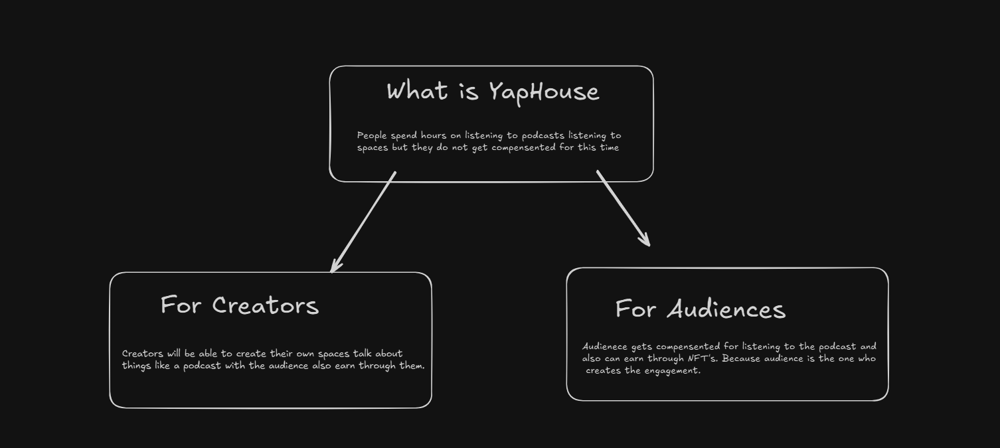

# YapHouse ( A Decentralised Social App)

### Do You Listen To Podcasts Twitter spaces or consume content on Social Media Apps well its time to get compensated for your TIME.

##

##

#### It's High Time Platforms stop being the profitable side in this transaction creators create content users spend time on them creating engagement but creators recieve a percentage of revenue and do not connect with the audience in a more authentic way and Users well you know they get nothing

##

     Repo Link For The Contract: https://github.com/YATHARTH-Sriv/yaphouse-contract

##
#### YapHouse solves this with not only helping users and creators to earn more and also create a good connection between audience and creators.

##

Currently We Are On Testnet phase

